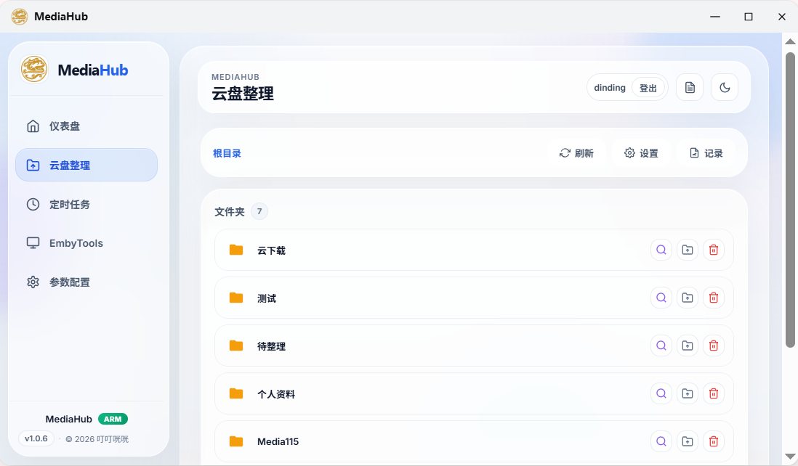
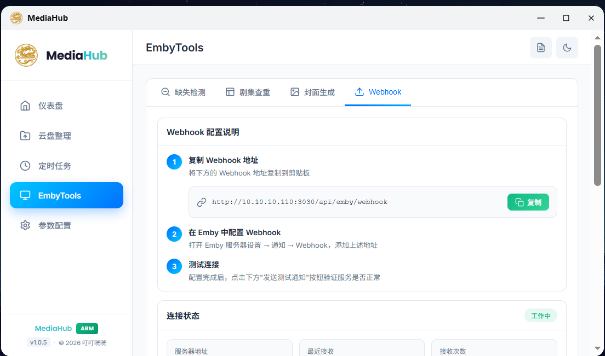

# MediaHub

  <strong>为你的 Emby 与 115 云盘打造的一站式媒体管理面板</strong>

  一个围绕家庭影音库、媒体自动化整理与消息通知打造的可视化控制台。

  
  
  
  
  

---

## 简介

MediaHub 是一个前后端一体的媒体管理面板，用来把 **Emby 仪表盘**、**115 云盘整理**、**定时任务**、**Webhook** 与 **消息通知** 集中到一个界面中。

它面向家庭影音库、NAS / Homelab 与个人媒体自动化场景，帮助你用更低的操作成本维护自己的媒体系统。

## 功能亮点

- **Emby 仪表盘**：查看媒体库统计、最近入库、最近播放与封面
- **Emby 工具集**：缺失剧集检测、剧集查重、封面生成、Webhook 日志
- **115 云盘整理**：自动识别文件信息，结合 TMDB 生成目标路径并执行整理
- **定时任务自动化**：签到、清理、自动整理等任务统一管理
- **消息通知**：支持 Telegram、微信、Webhook 相关通知能力

## 截图预览

### Dashboard

### Organize

### Emby Tools

### Tasks

### Settings

## 适用场景

- 家庭影音库管理
- Emby 媒体库维护
- 115 云盘下载后自动整理
- 需要通知与自动化任务的个人媒体系统
- Homelab / NAS 场景下的轻量控制台

## 技术栈

- **Frontend:** Nuxt 3, Vue 3, TypeScript
- **UI:** @nuxt/ui
- **Server:** Nitro / h3
- **Database:** better-sqlite3
- **Scheduler:** node-cron
- **Third-party:** Emby API, 115 云盘, TMDB, Telegram, 微信 iLink Bot

## 注意事项

- 项目依赖多个第三方服务，请确保相关配置正确可用
- 115 / Telegram / 微信能力依赖有效凭证或登录状态
- 建议先在测试目录验证整理规则与命名模板，再用于正式媒体库

## License

如需开源发布，请根据你的实际意图补充许可证，例如 MIT / Apache-2.0 / GPL-3.0。

当前仓库未检测到明确的 License 文件，因此本 README 不对授权方式做默认声明。
